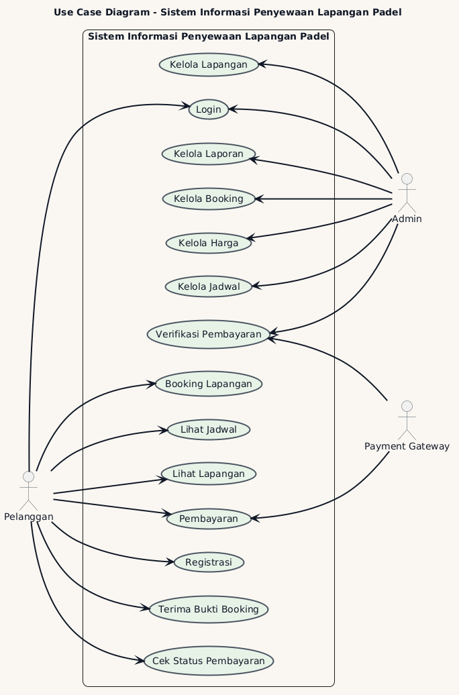

# Use Case Diagram
## Deskripsi
Use Case Diagram digunakan untuk menggambarkan interaksi antara aktor dengan Sistem Informasi Penyewaan Lapangan Padel.
Diagram ini menunjukkan fungsi-fungsi utama yang dapat dilakukan oleh Pelanggan, Admin, dan Payment Gateway.

## Aktor
### Pelanggan
- Registrasi
- Login
- Lihat Lapangan
- Lihat Jadwal
- Booking Lapangan
- Pembayaran
- Cek Status Pembayaran
- Terima Bukti Booking

### Admin
- Login
- Kelola Lapangan
- Kelola Jadwal
- Kelola Harga
- Kelola Booking
- Verifikasi Pembayaran
- Kelola Laporan

### Payment Gateway
- Memproses Pembayaran
- Mendukung Verifikasi Pembayaran

## Diagram

