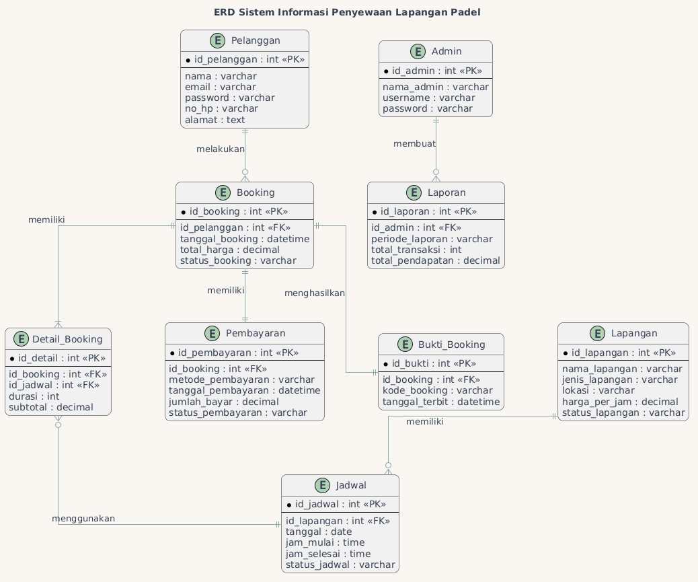

# Entity Relationship Diagram

## Deskripsi
ERD digunakan untuk menggambarkan struktur basis data dan hubungan antar entitas pada Sistem Informasi Penyewaan Lapangan Padel.

## Entitas
- Pelanggan
- Admin
- Lapangan
- Jadwal
- Booking
- Detail Booking
- Pembayaran
- Bukti Booking
- Laporan

## Diagram

